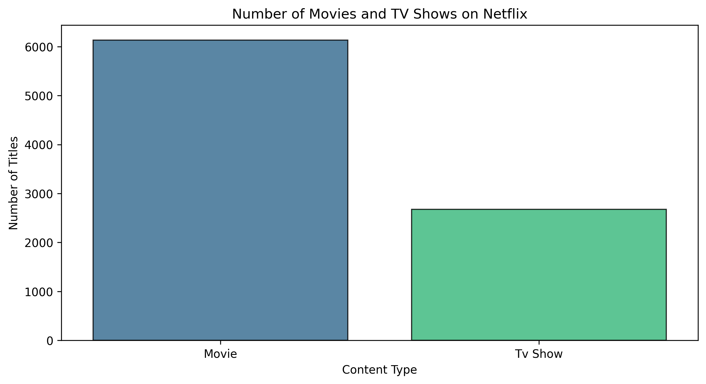
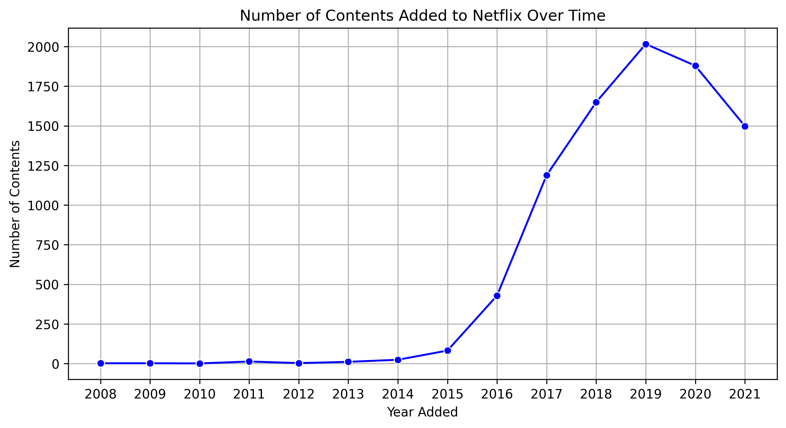
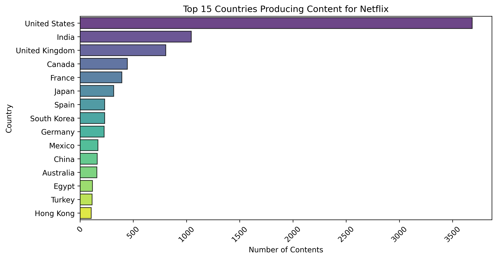
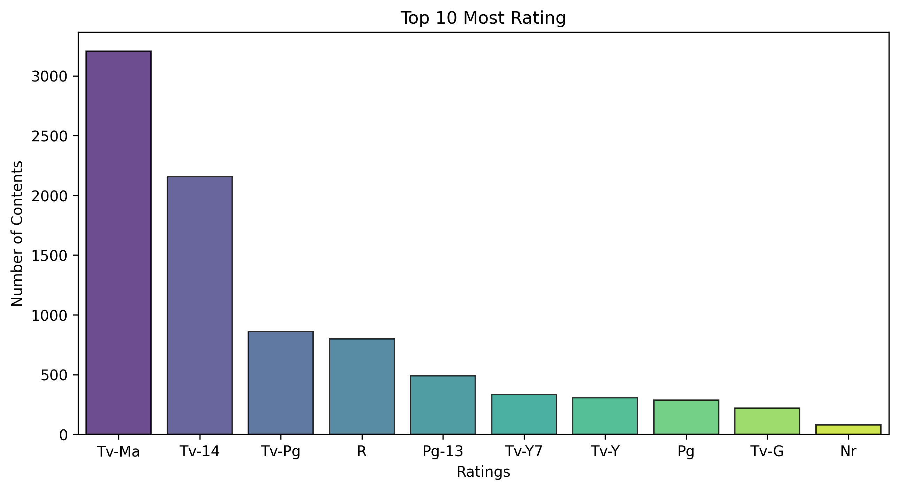
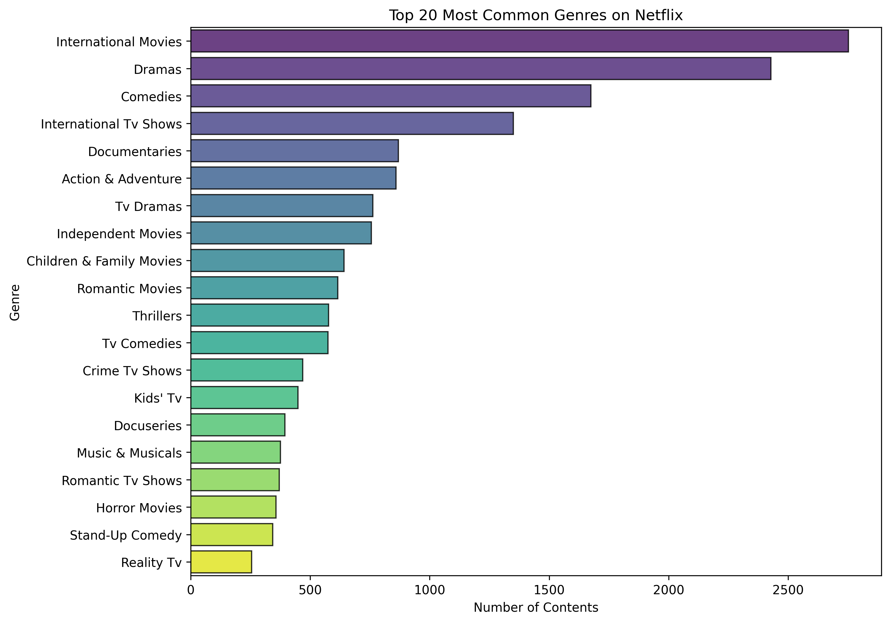
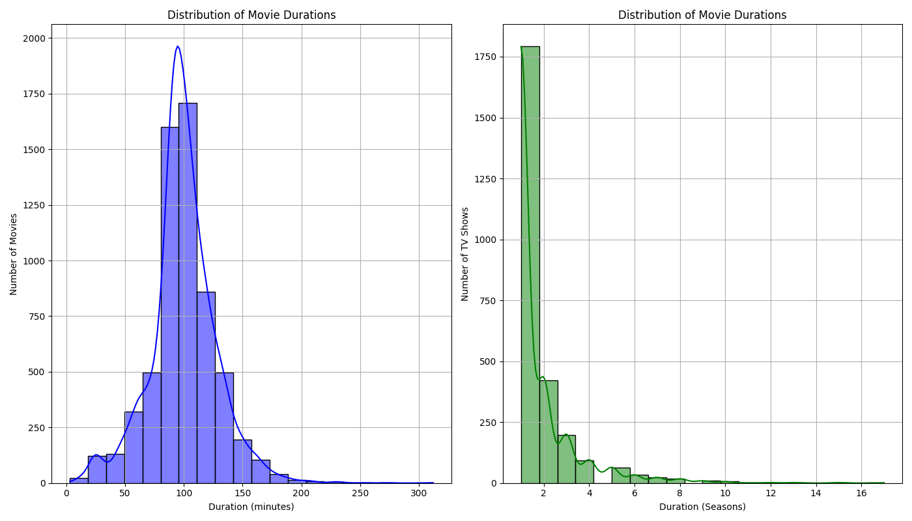
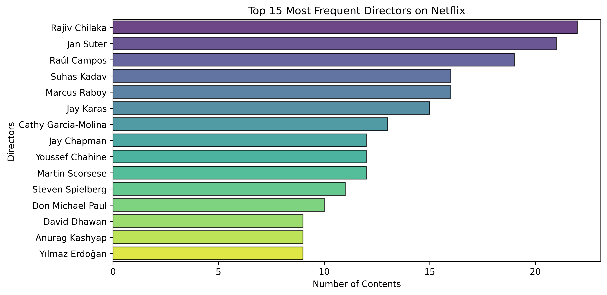

# Exploratory Data Analysis Report

## Objective

The objective of this sprint was to explore the cleaned Netflix dataset, identify key trends, and answer business questions using exploratory data analysis (EDA).

---

## Business Questions

The following questions guided the analysis:

1. What percentage of Netflix's catalogue consists of Movies versus TV Shows?
2. How has Netflix's content library changed over time?
3. Which countries contribute the most content?
4. What are the most common content ratings?
5. Which genres appear most frequently?
6. What is the distribution of movie durations?
7. Which directors have the largest presence in the catalogue?

---

## Key Findings

### 1. Content Type

- Movies represent approximately 70% of the catalogue.
- TV Shows account for approximately 30%.

---

### 2. Content Growth

- Netflix experienced steady growth in content additions over several years.
- The number of titles added reached a peak before declining in later years.

---

### 3. Country Distribution

- The United States contributes the largest number of titles.
- India and the United Kingdom follow as the next largest contributors.
- A relatively small number of countries account for a large portion of the catalogue.

---

### 4. Content Ratings

- TV-MA and TV-14 are the most common ratings.
- The catalogue primarily targets mature and teenage audiences.

---

### 5. Genres

- International Movies
- Drama
- Comedy
These genres dominate the catalogue.

---

### 6. Movie / TV show Duration

- Most movies have a duration between 80 and 120 minutes.
- Most TV Shows consist of a single season.

---

### 7. Directors

- The most represented directors have between 10 and 20 titles in the dataset.
- The results reflect only the Netflix catalogue included in this dataset.

---

## Challenges

- Some records contained multiple countries and genres within a single field.
- Missing values required cleaning before analysis.
- The `duration` column stored movie minutes and TV seasons together, requiring separate analysis.

---

## Skills Demonstrated

- Data exploration using Pandas
- Data visualization using Matplotlib
- Business-oriented exploratory analysis
- Data interpretation
- Git version control
- Technical documentation

---

## Conclusion

The exploratory analysis provided a clear overview of Netflix's content catalogue. The findings identified trends in content type, geographical distribution, audience ratings, genres, movie duration, and director representation. These insights establish a strong foundation for the SQL analysis and dashboard development in the next phases of the project.